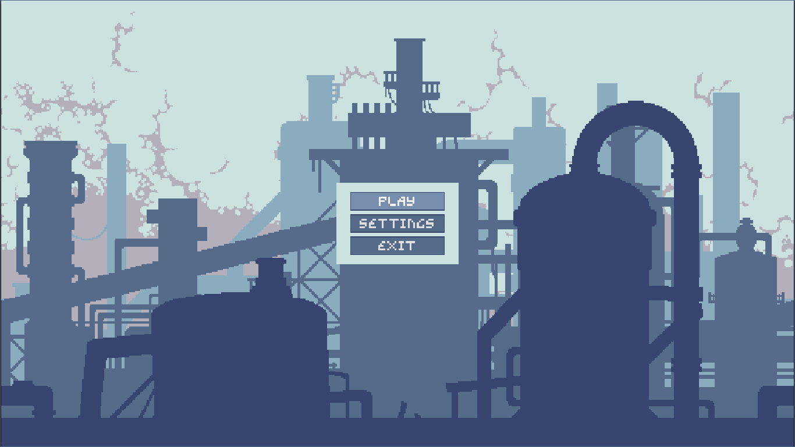
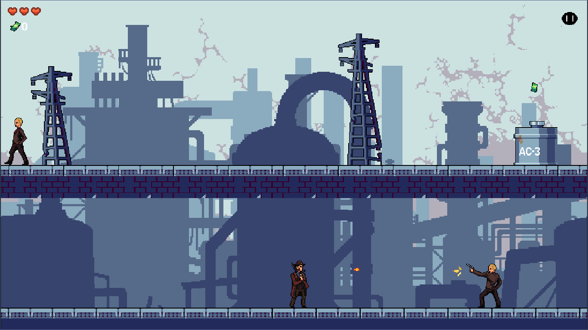
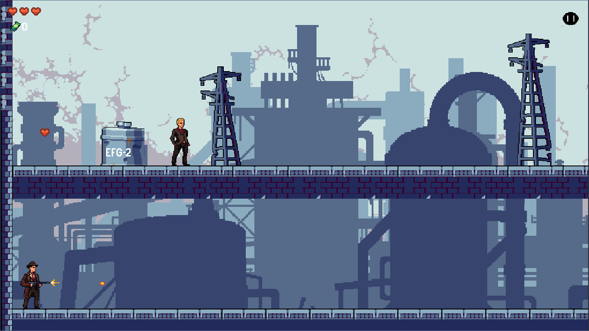

<!-- README Pixel Retro / Neon Theme – Gangsta's Life -->

  

  <i>"A retro 2D shooter inspired by Metal Slug, set in the gritty gangster underworld of 1930s Birmingham."</i>

---

# 🎮 Overview

**Gangsta’s Life** is a fast-paced 2D pixel-art shooter developed in **Godot 4** using **GDScript**, featuring  
retro-industrial environments, dynamic enemy AI, collectibles, and level progression via a key-door system.

You play as a mobster rising through the ranks of a violent post-war underworld — fighting rival gangs,  
collecting cash, surviving bosses, and unlocking the path to the next level.

---

# 🕹️ Gameplay Features

✅ **2D Pixel-Art Shooter**  
✅ **Enemies with State Machines** (idle, patrol, chase, punch, shoot)  
✅ **Player State Machine** (walk, run, jump, mid-air turn, shoot)  
✅ **Collectibles**  
- ❤️ Hearts → restore life  
- 💵 Cash bundles → add score  
✅ **Key & Door progression**  
✅ **Singletons (Autoloads)** for global music, lives, money, keys, HUD state  
✅ **Bullets as instanced scenes**  
✅ **Boss fights**  
✅ **Linear levels with branching paths**  
✅ **Adjustable window size**  
✅ **Smooth animations** & 30s gangster aesthetic  

---

# 🏭 Screenshots

  
   <i>Main Menu</i>

  
   <i>Combat & Level Progression</i>

  
   <i>Collectibles & Enemy Encounters</i>

---

# 🔥 Story Setting

After the Great War, England faces unrest, poverty, and a rising criminal scene.  
In **Birmingham**, street gangs fight for control of the abandoned factories that now hide cash, weapons,  
and opportunity.

You’re part of a small gang trying to rise against stronger crews and bosses — one level at a time.

---

# 🧠 Technical Architecture

## 🛠 Engine & Language
- **Godot 4**
- **GDScript**

## 🎯 Design Patterns Used
### ✅ **Singletons (Autoloads)**
Used for:
- Music manager  
- Player lives  
- Money/score  
- Keys & door events  
- Global game state  

### ✅ **Finite State Machines**
Used for:
- Player movement & animation  
- Enemy AI (punch, shoot, chase, idle)  
- Boss behavior  

### ✅ **Signals (Event-Driven Architecture)**
To keep the project modular & decoupled.

### ✅ **Scene Instancing**
Bullets, HUD, enemies, hearts, money, keys, etc.

---

# 🎮 Controls

| Action | Key |
|--------|------|
| Move | Arrow keys / WASD |
| Run | Shift |
| Jump | Space |
| Shoot | L |
| Pause | P |

---

# ▶️ How to Run

1. Download **Godot 4.x**
2. Clone the repository:
git clone https://github.com/joacko23/GangstasLife.git
3. Open the project in Godot  
4. Run the main scene (`Main.tscn`)

---

# 🚧 Roadmap

- [ ] New enemy types  
- [ ] More weapons  
- [ ] New bosses  
- [ ] Additional levels  
- [ ] Save/Load system  
- [ ] Sound FX improvements  
- [ ] Mobile version  

---

# 👨‍💻 Author

**Joaquín Domenech**  
💻 Full-Stack & Game Developer  
📧 joackodomenech@gmail.com  

